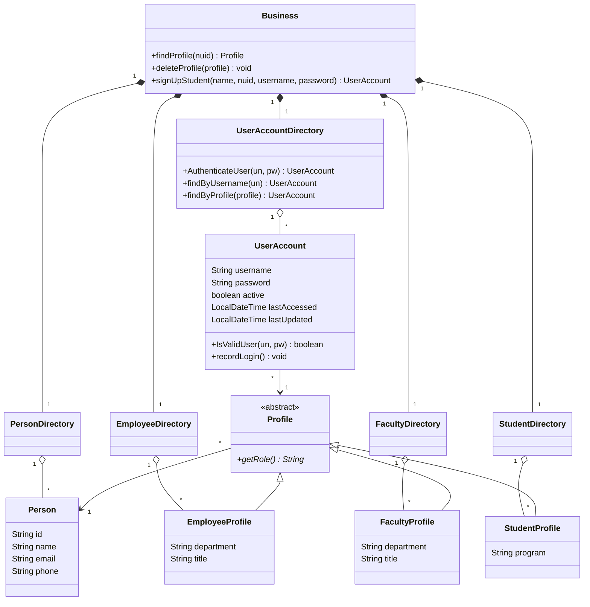

# Assignment 3 – Profiles and Work Areas

**INFO 5100 Application Engineering and Development**, Fall 2026
Dias Mukhametrakhim, NUID 003185578

A Java Swing application built on the course's ProfileWorkArea skeleton. People log in and get the work area for their role: admin, faculty or student. Admins manage user accounts, employees, students and faculty, and new students sign up from the welcome screen.

## How to run

1. Open the `Assignment3_ProfileWorkArea` folder in Apache NetBeans 16 (File → Open Project), with JDK 19.
2. Run the project. The main class is `ProfileWorkAreaMainFrame`.

The app starts with this demo data:

| Role | Name | NUID | Username | Password |
|---|---|---|---|---|
| Admin | John Smith | 001000001 | `admin` | `admin123` |
| Faculty | Gina Montana | 001000002 | `gina` | `gina1234` |
| Student | Adam Rollen | 002000001 | `adam` | `adam1234` |
| Student, not signed up yet | Laura Brown | 002000002 | – | – |

The admin has registered Laura Brown as a student but she has no login yet, so she is the person to try Sign Up with.

## What each role can do

**Welcome screen**
- Log in with a username and password. The password field hides what you type. Empty fields, a wrong username or password, and a disabled account each get their own message.
- Sign Up creates a Student account (see the rules below).
- After login, the left panel shows who is logged in and a Log Out button, which returns to the welcome screen.

**Admin**
- **Administer User Accounts:** every account with its role, status, last login and last update. Add an account for an existing person by NUID, change a username, password or active status, or delete an account. An admin cannot disable or delete their own account.
- **Manage Employees (HR):** register an employee with NUID, name, email, phone, department, title and a login; update or delete them. Deleting an employee also deletes their login. An admin cannot delete their own employee profile.
- **Manage Students:** add a student by NUID, name, email, phone and program. This creates no login; the student signs up. Update or delete students; deleting a student also deletes their login.
- **Manage Faculty:** add a faculty member with a login, update or delete them.
- **My Profile:** the admin's own details.

**Faculty**
- **My Profile.** The other buttons belong to later assignments and show a message saying so.

**Student**
- **My Profile:** name, NUID, email, phone, program and login details. The other buttons belong to later assignments.

## Sign-up rules

Sign-up always creates a Student account. Admin and faculty accounts come only from the admin panel.

| NUID entered on the Sign Up page | Result |
|---|---|
| Added by the admin as a student, no login yet | The new account is linked to that student. The name must match the admin's record. |
| Not registered anywhere | A new student is created together with the account. |
| Already has a login | Refused: the student should log in instead. |
| Belongs to an employee or faculty member | Refused: staff accounts are created by the administrator. |

## Validation

- Every field is required, and the message names the empty one.
- **Username:** 3–20 letters, digits, dots or underscores, unique ignoring case (login ignores case too).
- **Password:** at least 6 characters with at least one letter and one digit, and no spaces. Sign-up asks for it twice.
- **NUID:** unique across all people and fixed once created. Its format is not checked, since the assignment does not require data type validation.

## Where each requirement is met

| Requirement | Where |
|---|---|
| Admin adds, updates and deletes accounts | Administer User Accounts |
| When an account was last used and last updated | Last Login and Last Updated in the accounts list, the account screen and My Profile |
| Register a new employee with all the necessary information | Manage Employees (HR) |
| Admin adds, updates and deletes student profiles | Manage Students |
| Admin's My Profile | Admin work area → My Profile |
| `FacultyDirectory` and `FacultyProfile`, a pre-populated faculty login | `Business.Profiles`; Gina Montana in `ConfigureABusiness` |
| Sign-up page from the welcome screen, students only | Sign Up → `SignUpJPanel`, `Business.signUpStudent` |
| Admin adds a NUID and the student signs up with it | Manage Students, then Sign Up (Laura Brown) |
| Student's My Profile with name and NUID | Student work area → My Profile |
| Hidden password field | A `JPasswordField` wherever a password is typed |
| No empty text fields | `Validator.isFilled` before every save |
| Username/password validation and authentication | `Validator`, `UserAccountDirectory.AuthenticateUser`, the disabled-account check |
| Message boxes | Every save, delete, refusal and error |

## How the code is organized

- `Business`: the model. `Business` owns one directory per kind of object. `Person` is the human, and their id is the NUID. `Profile` is a role, with the subclasses `EmployeeProfile` (the admin), `FacultyProfile` and `StudentProfile`. `UserAccount` is the login for one profile.
- `ProfileWorkAreaMainFrame`: the window, with login on the left and a CardLayout stack of screens on the right. `ConfigureABusiness` builds the demo data.
- `UserInterface.WorkAreas.<Role>Role`: one work area per role. The admin's responsibilities live in the `...WorkResp` packages under `AdminRole`.
- `UserInterface.WorkAreas.MyProfileWorkResp`: My Profile, shared by all three roles.
- `UserInterface.SignUp`: the Sign Up page. `UserInterface.Validator`: input checks shared by every screen.

## A quick walkthrough

1. Log in as `admin` / `admin123`. Administer User Accounts lists three accounts, and Manage Students shows Laura Brown as "Not signed up".
2. Log out and click Sign Up. Enter Laura Brown, NUID `002000002`, username `laura`, password `laura123` twice. Log in as `laura`: My Profile shows her name and NUID.
3. Sign Up again with NUID `002000002` (already has an account) and with `001000001` (a staff member). Both are refused.
4. Log in as `gina` / `gina1234` to see the faculty work area and her My Profile.
5. As `admin`, register an employee with a login and log in as them. Then disable an account in Administer User Accounts and watch that login get refused.

Built on the ProfileWorkArea skeleton by Kal Bugrara.
